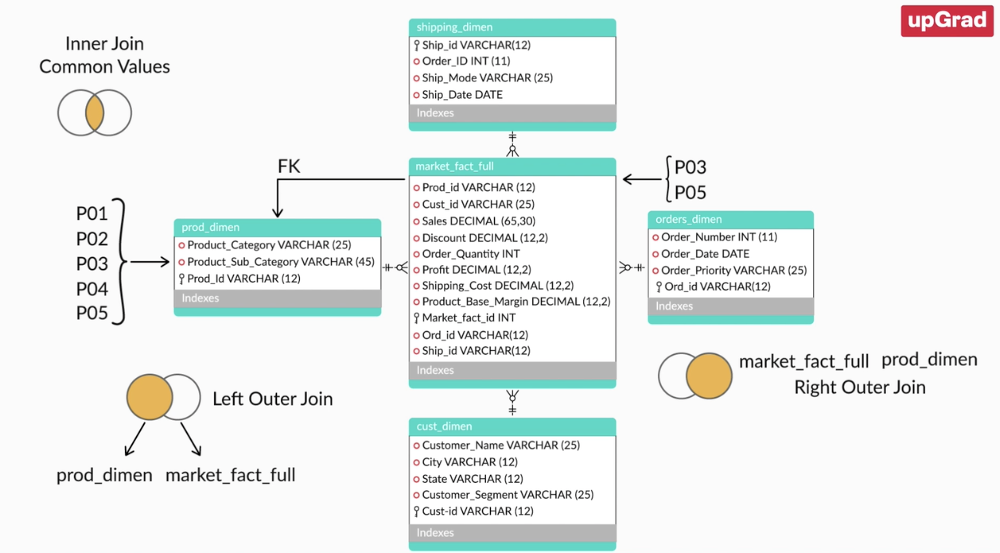

## SELECT QUERY

**SELECT** _attributes_

**FROM** _table_

**INNER JOIN** _table_ **ON** _table1.column = table2.column_ 

**LEFT/RIGHT JOIN** _table_ **ON** _table1.column = table2.column_ 

**WHERE** _filter condition_

**GROUP BY** _attributes to be grouped upon | aggregate functions_

**HAVING** _filter condition on grouped/aggregated values_

**ORDER BY** _values_

**LIMIT** _no of values to display_

## OPERATORS
- **ARITHMETIC**: + - * / %
- **COMPARISON**: = > < >= <= <>'
- **LOGICAL**: ALL AND ANY BETWEEN EXISTS IN LIKE NOT SOME

## FUNCTIONS
- AGGREGATE FUNCTIONS: COUNT(), MIN(), MAX()
- GROUP_CONCAT()
- STRING FUNCTIONS: CONCAT(), UPPER(), SUBSTRING, SUBSTRING_INDEX
- DATE FUNCTIONS: MONTH(), YEAR()
- REGULAR EXPRESSIONS

## NESTED QUERIES
- SELECT col1, col2 FROM table1 WHERE col1 = (<QUERY>)
- JOINS
    - INNER JOIN
    - OUTER JOIN
    - MULTI JOINS   

## CTES 
- Common Table Expressions: Create a temp table and is used part of the main query
- CTE is a **temporary** named result set that you can reference within a SELECT, INSERT, UPDATE, or DELETE statement. The CTE can also be used in a View.
- Problem solving tool - Instead of nested query CTEs could be use

## VIEWS
- Named query; For Reuse
CREATE VIEW <NAME> AS <SELECT QUERY>

## SET OPERATIONS
- UNION, UNION ALL, INTERSECT, MINUS

# Home work
30. Which project(s) have the least number of employees?
select pno, count(*) as numemps
from works_on
group by pno
having count(*) =
	(select min(nemps)
	from (
		select pno, count(*) nemps
		from works_on group by pno
	     ) tempproj
	 );