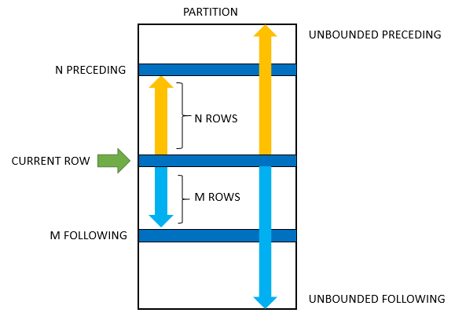
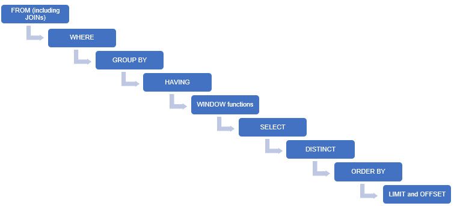

# PGDS: Database Design and Introduction to MySQL

- **Data warehouse** A data warehouse is a relational database that is designed for query and analysis rather than for transaction processing. It usually contains historical data derived from transaction data, but it can include data from other sources. It separates analysis workload from transaction workload and enables an organization to consolidate data from several sources.Collection of data with the following properties
	- Subject-oriented
	- Integrated
	- Non volatile
	- Time variant
	Dimensional modelling
	Facts - numerical values
	Dimensions

**OLTP** transactional database (i.e., OLTP, or Online Transactional Processing. used for day-to-day transactions.  is characterized by a large number of short on-line transactions (INSERT, UPDATE, DELETE). 

**OLAP** data warehouse OLAP, or Online Analytical Processing: used for analytical purposes. ETL. s characterized by relatively low volume of transactions. Queries are often very complex and involve aggregations. 
**SETL** Select, Extract, Transform, Load
**Schema**: Structural description of db
Data Model: Language to describe the schema
ERD | Entity Relational Diagram: Visual Representation
Relational Data Model: Input to the DBMS

**Relational Data Model**
Elements of relational schema
- Table/Columns
- Constraints
	- Entity constraints - unique, null, primary key (unique & not null; only one primary key)
	- Referential integrity constraints - constraints based on a value in another table. a given table has only one primary key but it can have multiple foreign keys. Before you assign a column as a foreign key, you need to ensure that the primary key column of the table that it refers to is present and it does not have null or duplicate values.
	- Semantic constraints

## Normalization
- 1st NF: Each cell has single value. Each record needs to be unique
- 2nd NF: 1st NF + Each row must be identified by a single column unique key
- 3rd NF: 2nd NF + No functional dependency (changing if a non-key column causes other non-key columns to change)

## CTE - Common Table Expression
With abc_table AS (
	SELECT * FROM employee
) SELECT * FROM abc_table

## VIEW
CREATE VIEW abc_view AS SELECT * FROM employee

SELECT * FROM abc_view;

## Windows Functions

https://dev.mysql.com/doc/refman/8.0/en/window-function-descriptions.html

Windows function or analytic function is a function which uses values from one or multiple rows to return a value for each row. This contrasts with an aggregate function, which returns a single value for multiple rows.

Window functions applies aggregate and ranking functions over a particular window (set of rows) using the OVER clause. OVER clause defines the window
- Groups rows into partitions using the PARTITION BY clause and the function is applied to each partition separately. OPTIONAL. If the PARTITION BY clause is omitted, then the entire result set treated as a single partition. This clause works on windows functions only. Like RANK(), LEAD(), LAG() etc.
- Orders rows within those partitions into a particular order using ORDER BY clause. MANDATORY

window frame, which comprises a set of rows relative to the row that is currently being evaluated by the analytic function.

- Aggregate Window Function : SUM(), COUNT(), AVERAGE(), MAX(), MIN()
- Rank functions: 
	- RANK(): Rank of the current row within its partition, with gaps
	- DENSE_RANK(): Rank of the current row within its partition, without gaps
	- PERCENT_RANK(): Percentage rank value; it will always lie between 0 and 1
	- ROW_NUMBER(): Assigns unique numeric values to each row, starting from 1
- Named windows: A named window makes it easier to define and reuse multiple window functions. 
- Frames: Frames are used to subset a set of consecutive rows and calculate moving averages. A window frame is used to specify how many rows around the current row the window should include. Used for calculating moving averages
		https://www.sqlitetutorial.net/sqlite-window-functions/sqlite-window-frame/

- Lead and lag functions: These functions are used to compare a row value with the next or the previous row value.

## User-defined functions Vs Stored Procedures

| User-defined functions | Stored Procedures |
| --- | ---|
| Called from SELECT statement | Called using CALL statement |
| Must return a value | Need not return a value |
| Only select operations are allowed | All database operations are allowed |

These are specific to the DBMS being used.

## Cursors

A cursor is used to individually process each row that is returned in a query.

## Index
Indexes are used to find rows with specific column values quickly. Without an index, MySQL must begin with the first row and then read through the entire table to find the relevant rows. The larger the table, the more this costs. If the table has an index for the columns in question, MySQL can quickly determine the position to seek to in the middle of the data file without having to look at all the data. This is much faster than reading every row sequentially.

Clustered Non-Clustered

## Order of execution 

## Joins vs Nested Queries

select <column_1>, <column_2>

from table_1 a

inner join table_2 b

on a.<common_column> = b.<common_column>;

## Best Practices
- Add appropriate comments
-  use table aliases when your query involves more than one source table.
- Write keywords in CAPITALs and the variables are in lowercase
- Use abbreviations as Aliases
- Maintain right indentation to the queries
- Use SQL Formatter to beautify the queries

- Filter out the rows, columns 

- Choose INNER JOINS over OUTER JOINS
- Index the columns that are frequently queried
- Choose GROUPBY over DISTINCT
- In SELECT, choose required columns over *
- Avoid ORDER BY unless required
- Choose WHERE over SELECT * with LIMIT
- Check the processing time of the query options before choosing one of the query
- executing a statement with the 'join' clause creates a join index, which is an internal indexing structure. This makes it more efficient than a nested query. However, a nested query would perform better than a join while querying data from a distributed database.

query processors internally optimise queries to obtain better performance.

use upgrad;

# show tables;
# Write your code below
WITH store_details AS
(
    SELECT s.store_id, ci.city city
    FROM store s 
    LEFT JOIN address a ON a.address_id = s.address_id
    LEFT JOIN city ci ON ci.city_id = a.city_id
),
film_details AS 
(
    SELECT film_id, name
    FROM film_category fc 
    LEFT JOIN category c ON c.category_id = fc.category_id
),
inventory_details AS 
(
    SELECT i.inventory_id inventory_id,fd.film_id film_id, sd.store_id, city, fd.name name
    FROM inventory i
    LEFT JOIN store_details sd ON i.store_id = sd.store_id
    LEFT JOIN film_details fd ON fd.film_id = i.film_id
)
SELECT name, city, COUNT(inventory_id) category_count
FROM inventory_details
GROUP BY name, city;

#SELECT city_id, city FROM city WHERE city = "Woodridge";

#DESC film_category;

