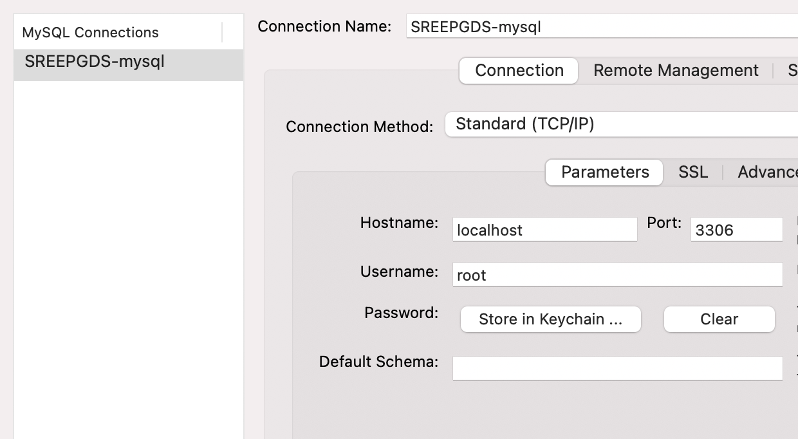

https://dev.mysql.com/doc/mysql-linuxunix-excerpt/5.6/en/docker-mysql-getting-started.html
docker pull mysql/mysql-server:latest
docker run -p 0.0.0.0:3306:3306 --name=SREEPGDS-mysql -d mysql/mysql-server:latest
docker logs SREEPGDS-mysql 2>&1 | grep GENERATED
[Entrypoint] GENERATED ROOT PASSWORD: #fvY*7Tsbt#+1n5s?;v4I56b=1xW1;gq

docker exec -it SREEPGDS-mysql mysql -uroot -p
mysql> ALTER USER 'root'@'localhost' IDENTIFIED BY 'SREEPGDS-mysql';

# FOLLOWING IS NEEDED TO CONNECT TO MYSQL FROM MYSQL WORKBENCH
mysql> create user 'root'@'%' identified by 'SREEPGDS-mysql';
mysql> grant all privileges on *.* to 'root'@'%' with grant option;
mysql>  select host, user from mysql.user;

+-----------+------------------+
| host      | user             |
+-----------+------------------+
| %         | root             |
| localhost | healthchecker    |
| localhost | mysql.infoschema |
| localhost | mysql.session    |
| localhost | mysql.sys        |
| localhost | root             |
+-----------+------------------+

