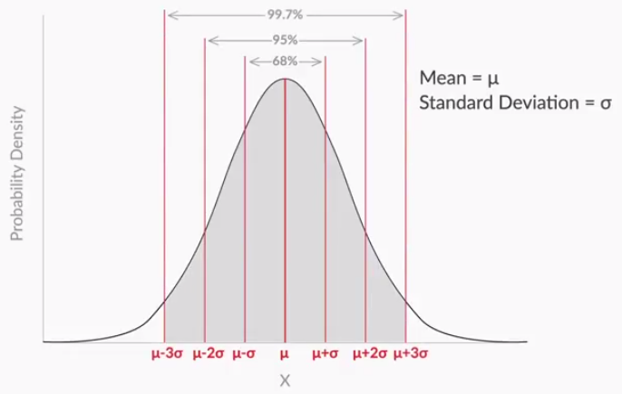
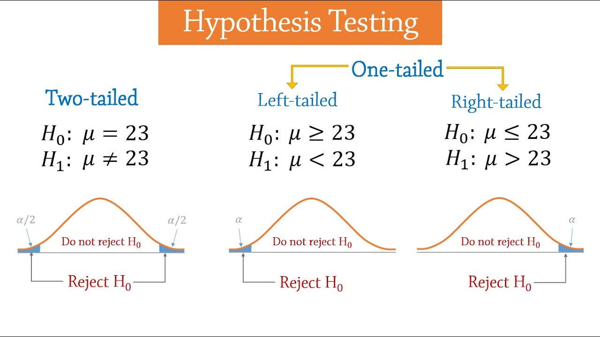

## DOUBTS
- How are CLT, HT, A/B Testing used in Data Science?

- How does hypothesis testing help in finding relations between variables and selecting variables for a predictive model?
    - Understand the relationship between the variables - if they are significant relationship.
    - Reduction in the number of variables going into the model. Leave variables that do not have a significant relationship
In this case, what will the null (and alternate) hypotheses be?

- Types of errors

- How is the variance/standard deviation calculated in the hotstar problem? I used variance = p(1-p)

- Z-score : Intuition/what does signify?

- When (in which scenarios) we use the  tests - Z-test, T-test, F-test, Chi-square test, Anova? 
- Which tests have to be used for the Sample types - single, pair, categorical?
- What is the difference between sample mean and sample proportions? How are these related to the tests?

    - significance, test statistic
    - Z-test, T-test, F-test, Chi-square test, Anova
    - Sample type : single, pair, categorical, mean Vs proportions
    - Degrees of freedom

| Type of variable | |
|---|---|
| Single Categorical | SE of proportion |
| Single Quantitiative | SE of mean |
where SE is Standard Error = Std. dev. of a sampling distribution

Groups:
- Independent: groups are unrelated to each other
- Paired - Case in each groups are meaningfully matched with one another

## Probability

- **Expected Value (or expectation, average or mean value)** for a variable X is the value of X that we would “expect” to get after performing the experiment an infinite number of times.
    - E[X]=∑ X × P(X)

### Binomial probability: P(X=r) = nCr (p)^r (1−p)^n−r
Where n is the number of trials, p is the probability of success, and r is the number of successes after n trials.
However, there are some conditions that need to be met in order for us to be able to apply the formula.
- The total number of trials is fixed at n.
- Each trial is binary, i.e., it has only two possible outcomes: success or failure.
- Probability of success is the same in all trials, denoted by p.

### Cumulative probability of X, denoted by F(x), 
is the probability of the variable being less than or equal to x.

## Distributions
# Probability distribution 
A form of representation that tells us the probability for all the possible values of X.
X Vs P(X)

### Cumulative distribution function
distribution that plots the cumulative probability of X against X.

### Probability Density Function
is a function in which the area under the curve gives you the cumulative probability.
 PDFs are used more commonly that CDFs.

### Normal & Standard Normal distributions

A standardised normal distribution is a special type of normal distribution where μ = 0 and σ = 1.

A normal distribution is converted into a standardised normal distribution with the help of the Z score.

Z-score = (x − μ) / σ
-How many standard deviations away from the mean your random variable is. 
- P(2 < Z < -2) = P(mu-2sigma < X < mu+2sigma )

https://www.simplypsychology.org/z-score.html

It is more theoretical, not found so much in real-life.
Distributions are convverted to normal distribution so that some rules/properties of normal distribution are applicable.

### Uniform distribution
continuous random variable following a uniform distribution, the value of probability density is equal for all possible values.

### Log Normal Distribution
More common in real-life

### Bionomial & Bernoulli distribution

## Terminology
- **Sample & Population**
    | | Sample | Population |
    | -----------------|----|----|
    | Constant | Statistic | Parameter |
    | Size | n | N |
    | Mean | x | μ |
    | Standard Deviation | S | σ |
    | Proportions | p, q | P, Q |

- **Types of Samples**
    When comparing two or more groups, cases may be independent or paired.      
    - Independent Groups: Cases in each group are unrelated to one another.
        - e.g.:A shoe company is studying how many shoes Italian men and women own. In one research study they take a random sample of 500 Italian adults and ask each individual if they identify as a man or women and how many pairs of shoes they own. The men and women in this study are in two independent groups. 
    - Paired Groups: Cases in each group are meaningfully matched with one another; also known as dependent  samples or matched pairs
        - e.g.:An instructor wants to compare students' scores on the midterm and final exam. This is most often done by obtaining a sample of students and recording each student's midterm exam score and final exam score. In other words, there would be two measurements for each student. This is an example of a matched pairs design because data would be paired by student. 
    where Case: An experimental unit from which data are collected

- **Estimation**: The process of drawing inferences about a population using the information from its samples is known as estimation.
    

- **Skewness** 
Higher number of data points having low values
- Left/Negative skewed: Long tail on the left
- Right/Positive skewed: Long tail on the right 

## Statistical Inference

When you infer population mean from the sample mean there would be a margin of error (MoE). Sampling Distribution will help us calculate the MoE.

## Sampling distribution
Distribution of the sample means of a population. Take a number of samples and calculate the mean for each sample and plot the distribution. A sample distribution has properties listed in Central Limit Theorem. 

## Central Limit Theorem
No matter what the parent population distribution is, when you take samples, compute their means and find the sampling distribution, it will always be normal, or at least nearly normal. 
1. Sampling distribution’s mean (μ¯X) = Population mean (μ),
2. Sampling distribution’s standard deviation (standard error) = S.E. = 
    - = σ/ √n, where \sigma is the population’s standard deviation and n is the sample size, 
    - = S/ √n, where S is the sample's standard deviation
3. For n > 30, the sampling distribution becomes a normal distribution.

- Margin of error: Maximum error made in sample mean is margin of error
- Confidence Level: Probability associated with the claim is confidence level
    - e.g. P(36.6-2 < mu < 36.6+2) = 95.4%. We are 95.4% confident that population mean falls in between 36.6-2 and 36.6+2, where 36.6 is the sample mean
- Confidence intervals are methods for quantifying uncertainty in our estimates. A confidence interval contains a range of acceptable estimates of the population parameter. Values in a confidence interval are reasonable estimates for the true population value. Values not in the confidence interval are not reasonable estimates for the population value.
- Z* is the Z-score associated with a y% confidence level

- If Sample mean = X, std. dev. = S, size = n
- **Confidence interval** (y% confidence level) = X - Z*S/√n , X + Z*S/√n, where 
    - MoE = Z*S/√n
    - Z* is the Z score associated with y% confidence level

    | Confidence Level | Z* | 
    | -----------------|----|
    | 90 | 1.65 |
    | 95 | 1.96 |
    | 99 | 2.58 |

**How does CLT help?** CLT lets you assume that the sample mean would be normally distributed, with 
- mean mu and 
- standard deviation σ/√n (approx. S/√n)

Using this assumption, it is possible to find the margin of error, confidence interval, etc.

If confidence interval is not given, consider it as 95%

## Hypothesis Testing

**Hypothesis**: a claim or an assumption that you make about one or more population parameters. The hypothesis is always made about the population parameters. The sample parameters are only used as evidence to test the hypothesis.

All hypothesis tests are conducted on the **Sampling distribution**.

A **test statistic** is used in a hypothesis test when you are deciding to support or reject the null hypothesis. The test statistic takes your data from an experiment or survey and compares your results to the results you would expect from the null hypothesis.
https://www.statisticshowto.com/test-statistic/

| Hypothesis Test | Test Statistic | 
| -----------------|----|
| Z-Test	| Z-Score |
| T-Test	| T-Score |
| ANOVA	| F-statistic |
| Chi-Square Test | Chi-square statistic |

### 1.Formulate the null and alternate hypotheses
| Null Hypothesis H0 | Alternate Hypothesis H1 | |
| -----------------|----|----|
| Makes an assumption about the status quo | Challenges and complements the null hypothesis |
| =, <=, >= | !=, >, < > ||
|  | Non-directional| Directional |
|  | 2-tailed test | 1-tailed test | 
| | Pharmaceutical | Manufacturing |

### 2.Make a decision
1. **Critical value** method
- Find the critical values of the critical region
    - Specify the significance level of the test (alpha) i.e. probability of making an error. Take it a 5% if not specified in the problem.
    - Zc : Z critical value. Calculate the value of Zċ from the given value of α (significance level). 
    - Calculate the critical values (UCV and LCV) from the value of Zċ = population mean (from H0) +- (Zc x sample std.dev)
- Decide either to reject or fail to reject null hypothesis. Make the decision on the basis of the value of the sample mean x with respect to the critical values (UCV AND LCV). If the position of the sample mean is in the 
    - critical region --> Reject H0
    - acceptance region --> Fail to reject H0

2. **p-value** method
- The p-value is equivalent to the probability of the null hypothesis not being rejected. So, the smaller the p-value, the farther is the sample mean from the hypothesised population mean, which indicates more evidence in support of the sample mean lying in the critical region, and the alternative hypothesis is accepted. The technical definition of p-value - the probability of observing a similar or more extreme observation given the null hypothesis is true.
- Calculate the value of the z-score for the sample mean point on the distribution.
- Calculate the p-value from the cumulative probability for the given z-score using the z-table.
- Make a decision on the basis of the p-value (multiply it by 2 for a two-tailed test*) with respect to the given value of α (significance value).
    - if p-value < significance level : Reject H0
    - if p-value > significance level : Fail to reject H0

p is high, null will fly
p is low, null will go
If 

Reject H0:  here is evidence to support the alternative hypothesis.
Fail to reject H0: there is not evidence to support the alternative hypothesis

A test is considered to be **statistically significant** when the p-value is less than or equal to the level of significance (alpha).

| Method of making a decision | Reject H0 | Fail to reject H0 |
| -----------------|----|----|
| Critical Values | sample mean in critical region < LCV  or > UCV | sample mean in acceptance region > LCV  and < UCV | 
| p-Value | p-value < alpha |  p-value > alpha |

With an increase in the sample size, the denominator of the Z-score decreases, and thus, the absolute value of Z-score increases, which means that the sample mean would move away from the central tendency towards the tails. This means that the p-value would actually decrease. Conceptually, increasing the sample size will make the distribution of the sample means narrower, and chances of the sample mean falling in the critical region increase. So, the p-value will decrease.

## Types of errors
|  | Null hypothesis is TRUE | Null hypothesis is FALSE |
| -----------------|----|----|
| We decide to reject thye hypothesis |  TypeI error (Rejecting a true null hypothesis) | Correct decision | 
| We fail to reject thye hypothesis | Correct decision | TypeII error (failing to reject a false null hypothesis) | 

## Z Vs T-Test

If the population parameters - mean and std. dev. - are not available, then we use the T-test. Zc is found using the t-table instead of the z-table

## Two-Sample Mean Test
## Two-Sample Proportion Test

## Click-through Rate/CTR
Online marketing industry: Measures the action rate of some entity - may it be a banner ad, a home page of some website and so on.

In the case of online search, the CTR is the proportion of searches that were successful. 
Search CTR = Total number of successful searches/ total number of searches

Product manager's Claim: The Search CTR has increased from 35% to 40%

1. Formulate hypotheses
H0: p=0.4
HA: p≠0.4

Population:
    mean = 0.4
    variance = 0.24

Sample:
    n = 7400
    mean = 0.39

Sample distribution:
    std. dev = pop. std.dev/sqrt(n) = sqrt(0.24/7400) = 0.006
    Z-score = (X-mu)/std.dev = (0.39-0.4)/0.006 = -1.756

alpha = 0.05

## Graded questions:
H0: mu >= .6
H1: mu < .6

Population:
    mu = 0.6
    std. dev = 

Sample: 
    n = 81
    X = .575
    std. dev = .19

alpha = 0.01

Lower tailed test:
Zc = -1.285
CV = population mean (from H0) +- (Zc x sample std.dev) = 0.6 - ( 1.285 x .19)

## Bernoulli Distribution
A Bernoulli trial is one of the simplest experiments you can conduct in probability and statistics. It’s an experiment where you can have one of two possible outcomes. For example, “Yes” and “No” or “Heads” and “Tails.” 
Bernoulli Distribution: Discrete probability distribution  for a Bernoulli trial — a random experiment that has only two outcomes (usually called a “Success” or a “Failure”). pdf = px (1 – p)1 – x
The expected value for a random variable, X, from a Bernoulli distribution is: E[X] = p
The variance of a Bernoulli random variable is: Var[X] = p(1 – p).

## chi-squared 
Chi-Squared test of independence is used to determine whether or not there is a significant relationship between two nominal (categorical) variables.  

## One-way ANOVA
Analysis of variance (ANOVA) can determine whether the means of three or more groups are different. ANOVA uses F-tests to statistically test the equality of means.

- SST = Total Sum of Squares = Total variance
    - degrees of freedom = (m x n) - 1
- SSW = Sum of squares Within the Samples
    - degrees of freedom = m (n - 1)
- SSB = Sum of Squares Between the Samples
    - degrees of freedom = m - 1

SST = SSW + SSB

